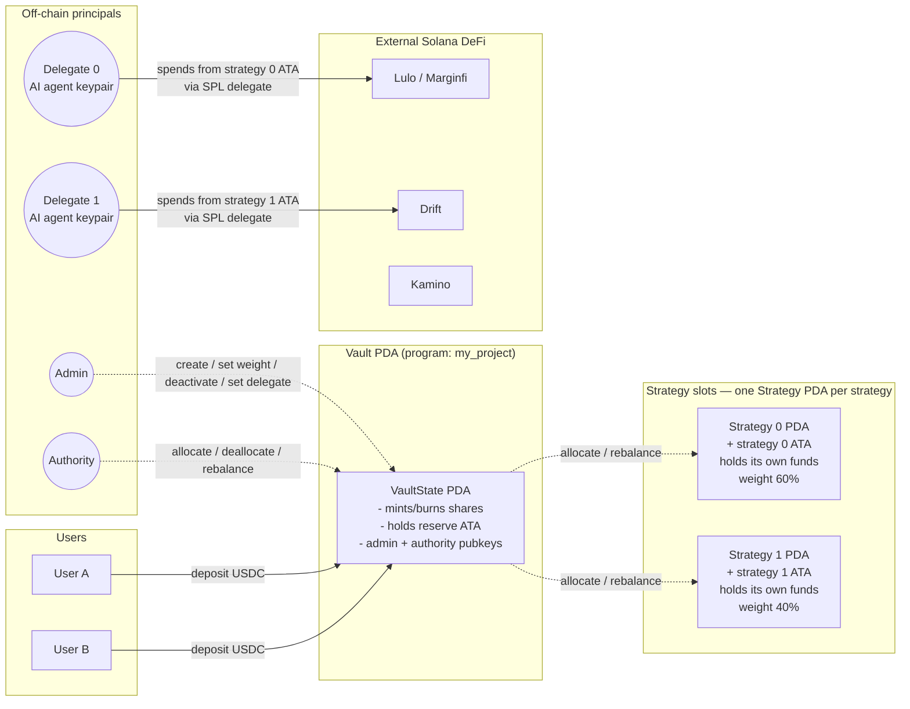
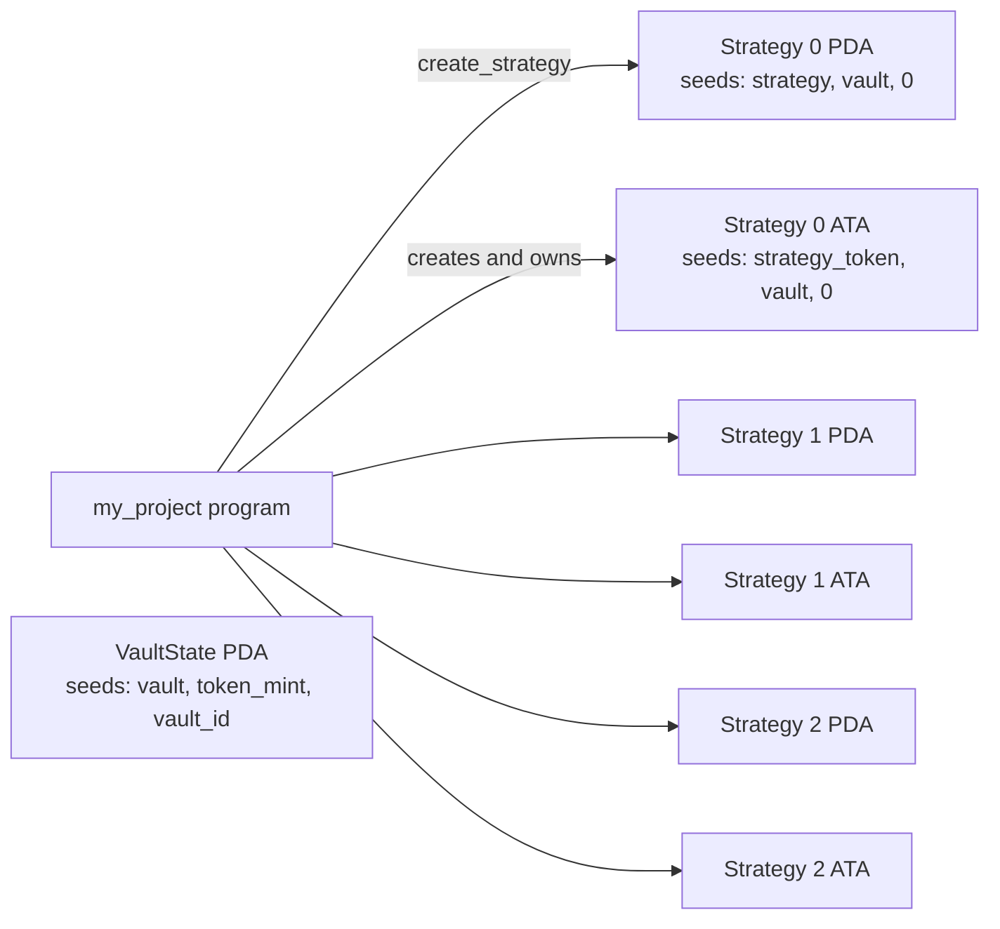
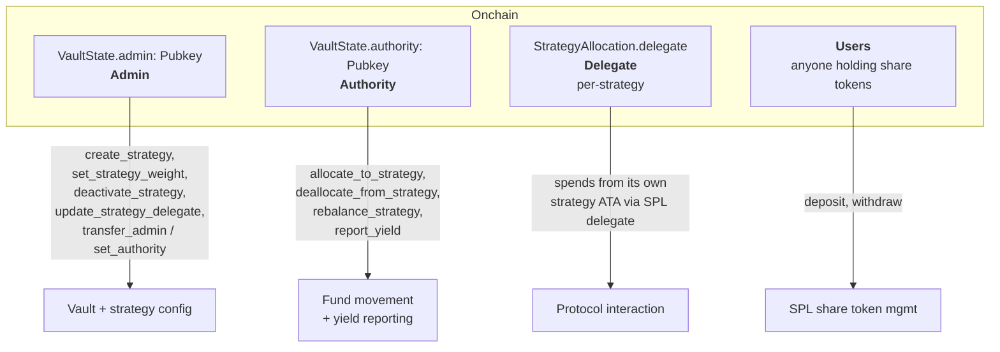
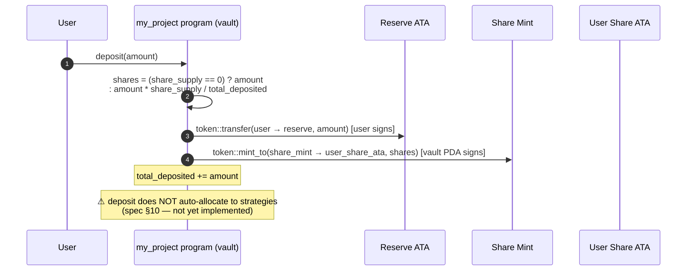
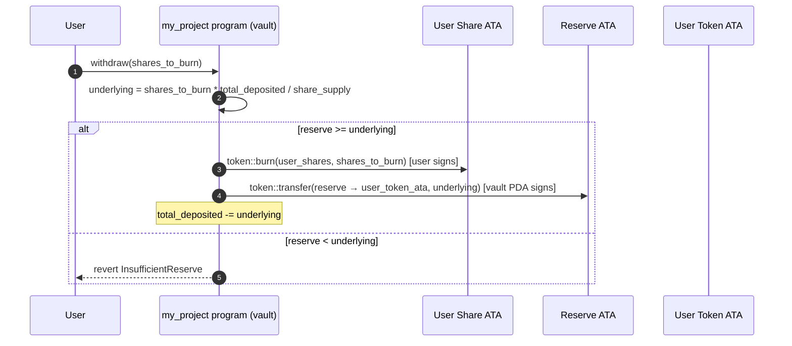
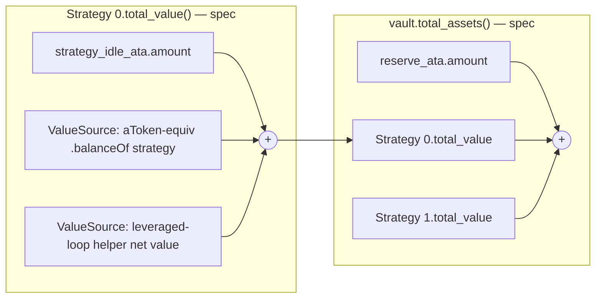
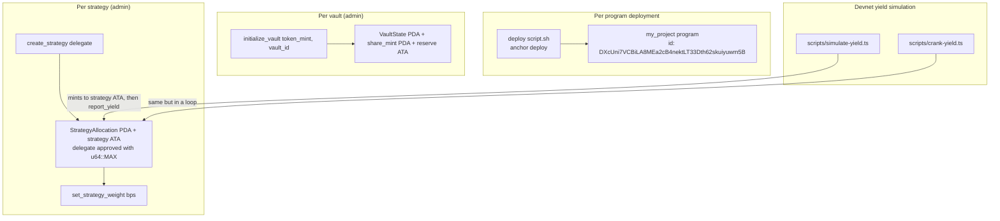

# Erebor — High-Level Overview

> **One line.** A non-custodial, multi-strategy Solana vault that
> isolates each AI-agent strategy in its own PDA + SPL token account,
> so a compromised agent can lose at most the funds inside its own
> strategy slot — never the rest of the vault, never another strategy,
> never another user.
>
> **Status note.** This document describes both *what is shipped today*
> and *what the spec calls for*. Sections that are aspirational are
> marked with a ⚠ callout linking to [MISMATCHES.md](MISMATCHES.md);
> trust the code, not the spec, when they disagree. The
> [SOLANA_VAULT_SPEC.md](SOLANA_VAULT_SPEC.md) build spec is the
> longer aspirational reference.

---

## 1. The problem

You want **autonomous AI agents** to actively manage Solana DeFi
positions — lend on Marginfi / Lulo / Drift, swap on Jupiter, loop on
Kamino, rebalance — **on behalf of many users at once**.

Three concerns make this hard:

| Concern              | What can go wrong                                                              |
| -------------------- | ------------------------------------------------------------------------------ |
| **Custody**          | Agent keys get phished → the agent drains the vault.                           |
| **Silent misuse**    | The agent signs an "innocent" tx that quietly reroutes funds to an attacker.   |
| **Spread of damage** | One bad strategy shouldn't hurt users who chose a different strategy.          |

Erebor answers them with one design decision: **every strategy lives
in its own pair of PDAs (one state, one token account), and the agent
delegated to that strategy can only spend from its own ATA**. The spec
extends this with an `execute_action` curation gateway + anti-theft
balance check + Solana-native instruction-introspection guarantee
([SOLANA_VAULT_SPEC.md §7.7](SOLANA_VAULT_SPEC.md)) — those layers are
the spec's strongest claim and are **not yet shipped** (see
[MISMATCHES.md §2.3](MISMATCHES.md)).

---

## 2. The design in one picture



**In short:**

- Users only interact with the **VaultState PDA** (`deposit` →
  receive SPL share tokens; `withdraw` → burn shares).
- The vault PDA owns **one ATA per strategy** plus the **reserve ATA**.
- An admin creates each strategy slot and approves the corresponding
  AI agent as the **SPL delegate** of that strategy's ATA. The agent
  can spend from that ATA only.
- Funds move between reserve and strategy ATAs via authority-gated
  `allocate_to_strategy` / `deallocate_from_strategy` /
  `rebalance_strategy`.

> ⚠ **Spec vs. code.** [SOLANA_VAULT_SPEC.md §7.7](SOLANA_VAULT_SPEC.md)
> calls for a curated `execute_action` gateway with anti-theft +
> instruction introspection, and [§5](SOLANA_VAULT_SPEC.md) calls for
> separate `vault_authority` and `strategy_authority` signer PDAs per
> strategy. Today the program uses the **single `vault_state` PDA** as
> the universal CPI signer, and the agent acts via plain SPL delegate
> rather than an `execute_action` whitelist — see
> [MISMATCHES.md §2.1, §2.3](MISMATCHES.md).

---

## 3. Three core ideas

### 3.1 Each strategy is its own pair of PDAs, not just a ledger row

Most multi-strategy vaults track per-strategy ownership in a lookup
table on the vault. **Erebor derives a separate `StrategyAllocation`
PDA + a separate strategy ATA per strategy id**:



**Why this matters:** strategy 0's delegate has SPL approval over
strategy 0's ATA only. They cannot touch strategy 1's funds, the
reserve, or the share mint — the program won't sign those CPIs for
them.

There is no minimal-proxy / `delegatecall` analogue (Solana doesn't
have one). The unit of code is the program; the unit of isolation is
the PDA.

### 3.2 Agents act via SPL delegate today; whitelisted via `execute_action` per spec

Today, when an admin calls `create_strategy(delegate)`, the program
invokes `spl-token approve(amount = u64::MAX)` on the strategy ATA so
the agent's keypair can spend. The agent then signs CPIs to external
protocols directly with their own keypair, paying for their own gas.

> ⚠ **Spec deferred.** [SOLANA_VAULT_SPEC.md §6, §7.5, §7.7](SOLANA_VAULT_SPEC.md)
> describes a curated whitelist: `AllowedAction` PDAs seeded by
> `(strategy, target_program, discriminator)`, with optional
> recipient-account-index validation. The agent would call
> `execute_action(strategy_id)` and the program would sign the inner
> CPI on the agent's behalf, having validated the relayed instruction
> against the whitelist. **Not yet implemented** — see
> [MISMATCHES.md §2.1, §2.3](MISMATCHES.md). Until it is, "the agent
> can only do approved things" is a curator-side promise enforced by
> careful key management, not an on-chain invariant.

### 3.3 Anti-theft (deferred): the program checks the delegate's balance + sibling instructions

> ⚠ **Spec deferred.** [SOLANA_VAULT_SPEC.md §7.7](SOLANA_VAULT_SPEC.md)
> describes a one-line invariant the spec's `execute_action` will
> enforce on every call:
>
> > *The delegate's asset balance must not increase as a result of the
> > inner call, and no sibling instruction in the same transaction may
> > be an SPL transfer signed by the delegate against their own ATA
> > (or any non-`agent_vault` instruction touching the strategy's ATAs).*
>
> Combined with the optional `recipient_account_index` check (the
> account at that index in the relayed instruction must equal a known
> strategy PDA), this prevents proceeds from being routed to the
> delegate or smuggled out via a sibling transfer.
>
> Solana's instruction-introspection sysvar makes this **stronger
> than the EVM version's anti-theft**: even a hostile relayed program
> cannot weaponise a same-transaction transfer signed by the agent.
> See [MISMATCHES.md §2.3](MISMATCHES.md) for the implementation gap.

---

## 4. Roles



| Role          | Held by                       | Can do                                                                     | Cannot do                                                              |
| ------------- | ----------------------------- | -------------------------------------------------------------------------- | ---------------------------------------------------------------------- |
| **Admin**     | Multisig (Squads) / EOA       | Create / configure / deactivate strategies, rotate delegates, transfer admin / set authority | Move funds directly                                                    |
| **Authority** | Operator EOA / keeper         | Push/pull funds between reserve ↔ any strategy, trigger weight-driven rebalance, report yield | Change roles, configs, or delegates                                    |
| **Delegate**  | AI agent keypair (per strategy) | Spend from its own strategy ATA via SPL approval                          | Touch any other strategy / the reserve / the share mint                |
| **User**      | Anyone holding shares         | `deposit`, `withdraw`                                                      | Anything privileged                                                    |

Admin and authority can be the same key; they're separated so a hot
operator key (authority) can rebalance without holding configuration
control (admin). Delegates are *not* a role — each delegate is a
single `Pubkey` stored on its own `StrategyAllocation` PDA.

The current program initializes `admin == authority == initializer`
at vault init; `transfer_admin` and `set_authority` let them diverge
afterward.

---

## 5. User flow — deposit



> ⚠ **Spec deferred.** Per [SOLANA_VAULT_SPEC.md §7.2 / §10](SOLANA_VAULT_SPEC.md),
> deposits should fan out to active strategies in id order based on
> `weight_bps`. Today they sit in the reserve until an authority
> calls `rebalance_strategy` (or `allocate_to_strategy` directly) for
> each strategy. See [MISMATCHES.md §2.8](MISMATCHES.md).

> ⚠ **Inflation attack.** First deposit is 1:1 with no virtual-shares
> offset. Per [SOLANA_VAULT_SPEC.md §9](SOLANA_VAULT_SPEC.md), a
> `VIRTUAL_SHARES = 1_000_000` constant should mitigate the
> donate-to-vault griefing path. See [MISMATCHES.md §2.4](MISMATCHES.md).

---

## 6. User flow — withdraw



> ⚠ **Spec deferred.** Per [SOLANA_VAULT_SPEC.md §7.3 / §10](SOLANA_VAULT_SPEC.md),
> a withdrawal that can't be filled from the reserve should auto-pull
> from strategies in id order (each running its `withdraw_config` CPI
> first). Today the call simply reverts with `InsufficientReserve` —
> an authority must manually free reserve via
> `deallocate_from_strategy` or `rebalance_strategy` first. See
> [MISMATCHES.md §2.8](MISMATCHES.md).

---

## 7. Agent flow — `execute_action` validation chain (deferred)

> ⚠ **Entirely deferred.** This whole section describes spec
> [§7.7](SOLANA_VAULT_SPEC.md). None of it is implemented yet —
> [MISMATCHES.md §2.3](MISMATCHES.md). Today the agent acts via plain
> SPL delegate, not via this gateway. The diagram below is the
> *intended* future flow.

```mermaid
flowchart TB
    Start([delegate calls execute_action<br/>strategy_id])

    Caller{caller == strategy.delegate<br/>OR vault.authority?}
    Active{strategy.is_active?}
    Guard{target_program not in<br/>guarded set?}
    WL{AllowedAction PDA exists<br/>strategy, target, disc?}
    Recip{recipient_account_index<br/>set?}
    RecipCheck{accounts[idx] ==<br/>expected_recipient?}
    Snap[snapshot delegate.asset_ata.amount<br/>before]
    Intro[iterate Sysvar1nstructions...<br/>reject hostile siblings]
    Call[invoke_signed<br/>strategy_authority seeds]
    Anti{delegate.asset_ata.amount<br/>did not increase?}
    Emit[emit ActionExecuted]

    Done([return])
    R1([NotDelegateNorAuthority])
    R2([StrategyInactive])
    R3([TargetGuarded])
    R4([ActionNotAllowed])
    R5([RecipientMustBeStrategy])
    R6([DelegateSignedSplTransferInTx])
    R7([CallFailed])
    R8([AntiTheft])

    Start --> Caller
    Caller -- no --> R1
    Caller -- yes --> Active
    Active -- no --> R2
    Active -- yes --> Guard
    Guard -- no --> R3
    Guard -- yes --> WL
    WL -- no --> R4
    WL -- yes --> Recip
    Recip -- no --> Snap
    Recip -- yes --> RecipCheck
    RecipCheck -- no --> R5
    RecipCheck -- yes --> Snap
    Snap --> Intro
    Intro -- hostile sibling --> R6
    Intro -- ok --> Call
    Call -- failed --> R7
    Call -- ok --> Anti
    Anti -- no --> R8
    Anti -- yes --> Emit --> Done

    classDef guard fill:#fff3cd,stroke:#b38500;
    classDef danger fill:#f8d7da,stroke:#842029;
    classDef happy fill:#d1e7dd,stroke:#0f5132;
    class Caller,Active,Guard,WL,Recip,RecipCheck,Intro,Anti guard
    class R1,R2,R3,R4,R5,R6,R7,R8 danger
    class Emit,Done happy
```

The spec orders the guards exactly as drawn (do not reorder when
implementing). The **instruction-introspection** branch is the most
important new claim relative to the EVM port — without it, a hostile
relayed program could trick the same transaction into bundling an SPL
transfer signed by the delegate against their own ATA, even though
the post-call balance check would still pass.

---

## 8. NAV — how the vault knows what it's worth (today vs. spec)

**Today (live):** the share price uses `total_deposited` on the vault
state, which is incremented at deposit and on `report_yield(strategy)`
calls. There is no live read over external positions; yield only
shows up in NAV when an authority explicitly calls `report_yield`.

**Per spec ([§8](SOLANA_VAULT_SPEC.md)):** NAV should be a live read
over each strategy:



Each value source is a `(target, data)` read per
`ValueSourceKind` (spec §6 — `SplAtaBalance`, `MangoLoopValue`,
`AccountU64`).

> ⚠ **Deferred.** No `ValueSource` PDA, no resolver, no
> `compute_total_assets` instruction. The current `report_yield` is
> the stand-in. See [MISMATCHES.md §2.1, §2.2](MISMATCHES.md).

---

## 9. Deployment topology



On **devnet** (see [DEPLOYMENT.md](DEPLOYMENT.md)):

- One program at `DXcUni7VCBiLA8MEa2cB4nektLT33Dth62skuiyuwm5B`.
- Five vaults today (per [app/src/lib/constants.ts](app/src/lib/constants.ts)),
  all on the same USDC test mint, indexed by `vault_id: 0..4`:
  *AT trader agent*, *Conservative*, *Aggressive Vault*, *Stablecoin
  Yield*, *DeFi Alpha*.
- Mock yield via [scripts/simulate-yield.ts](scripts/simulate-yield.ts)
  / [scripts/crank-yield.ts](scripts/crank-yield.ts). Real protocol
  integrations (Lulo / Marginfi / Drift / Kamino) are roadmap items
  ([AI_PLAN.md](AI_PLAN.md)).

On **mainnet**: same program code, swap the asset mint to real USDC.
No production deployment yet (slot reserved in
[DEPLOYMENT.md](DEPLOYMENT.md)).

---

## 10. Security model

| Threat                                                                             | Mitigation today                                                                                                                                | Mitigation per spec                                                                                                                  |
| ---------------------------------------------------------------------------------- | ----------------------------------------------------------------------------------------------------------------------------------------------- | ------------------------------------------------------------------------------------------------------------------------------------ |
| Agent key is stolen and tries to drain the vault                                   | Agent has SPL delegate over its strategy ATA only; loss capped at that strategy's allocation                                                    | + `execute_action` whitelist: agent can only call admin-curated `(target_program, discriminator)` pairs                              |
| A whitelisted call tries to reroute funds to the delegate                          | n/a (no whitelist yet)                                                                                                                          | Anti-theft check (delegate's asset ATA can't grow) + optional recipient-account-index check                                          |
| A hostile sibling instruction in the same tx steals from the delegate's ATA        | n/a                                                                                                                                             | Instruction introspection — reject sibling SPL transfers signed by the delegate, or non-`agent_vault` instructions touching strategy ATAs |
| Strategy A's delegate tries to move strategy B's funds                             | Per-strategy `strategy_authority[i]` PDA owns ATA *i*; even via `execute_action`, the inner CPI's signer seeds bind to a single strategy        | Same                                                                                                                                  |
| Re-entrancy during fund movement                                                   | Solana account-locking prevents the EVM re-entrancy class                                                                                       | Same                                                                                                                                  |
| Inflation attack on a fresh vault (donate-to-vault first depositor)                | OpenZeppelin virtual-shares offset (`VIRTUAL_SHARES = 1_000_000`) on both deposit and withdraw                                                  | Same (spec §9)                                                                                                                        |
| Admin makes a mistake and wants to "turn off" a strategy                           | `deactivate_strategy` revokes delegate, pulls remaining tokens, marks inactive — permanent                                                      | Same, plus required `total_value(strategy) == 0` precheck (spec §7.5)                                                                 |
| Strategy reactivation after deactivation                                           | Permanent — no reactivation path                                                                                                                | Same                                                                                                                                  |
| Configuration drift between strategies                                             | Single program, single source of truth; admin/authority pubkeys live on `vault_state`                                                           | Same                                                                                                                                  |
| Off-chain agent compromise                                                         | Authority can rotate via `update_strategy_delegate`                                                                                             | Same (`set_delegate`)                                                                                                                 |
| Token-2022 transfer-hook smuggling                                                 | `initialize_vault` rejects mints carrying `TransferHook` or `PermanentDelegate` extensions                                                      | Same (spec §13)                                                                                                                       |

---

## 11. Fee model

> **Status.** A single recurring fee is **shipped**: the
> withdrawal-time **performance fee** (default 5%, capped at 20%,
> per-vault changeable). Everything else in this section — deposit
> fees, vault/strategy creation fees, treasury and governance —
> remains spec-only and is flagged inline.

### 11.1 Why the protocol needs revenue

A vault that earns zero gets one product cycle of charity time
before its operator loses interest. The fees below pay for:

- protocol audits + ongoing security review (the headline cost),
- on-call indexers + RPC bills,
- a curator-rebate budget so admins are paid to research agents
  rather than chase yield directly,
- a buffer for emergency redemption (e.g. covering a strategy's
  insolvency from the protocol treasury rather than socializing
  the loss to share-holders).

The shipped model is **one recurring fee** charged at withdrawal
time. The rest of the model — a deposit fee, a treasury & multisig,
and the one-time creation fees — remains designed but unimplemented;
each is flagged below.

### 11.2 Recurring fees

| Fee              | Default          | Per-vault cap     | When charged                                         | Routed to                  | Status             |
| ---------------- | ---------------- | ----------------- | ---------------------------------------------------- | -------------------------- | ------------------ |
| **Performance fee** | **500 bps (5%)** | **2000 bps (20%)** | inside `withdraw`, on the redeemed underlying        | vault admin's ATA          | ✅ shipped          |
| Deposit fee         | 0 bps           | 50 bps (0.5%)     | inside `deposit`, on the underlying amount           | (future) `protocol_treasury` | ❌ deferred         |

#### Performance fee — `VaultState.performance_fee_bps` (shipped)

Charged on the gross redemption at `withdraw` time, *before* the
user receives the funds. Concretely: a user redeeming shares worth
100 USDC at a 5% fee receives 95 USDC and the vault admin's ATA
gains 5 USDC. The fee leaves `total_deposited` together with the
user's redemption (so the vault's share-price denominator stays
honest).

Mechanics:

```
gross   = shares_to_burn × total_deposited / share_supply
fee     = gross × performance_fee_bps / 10_000
net     = gross − fee
reserve_ata --(fee)--> admin_token_ata     // skipped if fee == 0
reserve_ata --(net)--> user_token_ata
total_deposited −= gross
```

Notes:

- Charging at withdrawal (not at `report_yield` time) is a deliberate
  trade-off: users see a single fee event tied to their own
  redemption rather than silent fees during opaque yield reports,
  and continuous-yield accounting bugs are avoided. The cost is
  that the fee is **flat on redemption** rather than a true
  performance fee on the user's individual cost basis — admins can
  set the rate to 0 for a stablecoin / principal-preserving vault
  to avoid charging users who never realised yield.
- The fee CPI is **skipped** when `performance_fee_bps == 0`, so
  fee-free vaults pay no extra compute and don't strictly need an
  initialised admin ATA.
- The fee always flows to the **vault admin's** underlying ATA. If
  admin is rotated via `transfer_admin`, future fees flow to the new
  admin automatically. A protocol-level `protocol_treasury` field
  is still future work.
- The default is **5%**, set in the program as
  `DEFAULT_PERFORMANCE_FEE_BPS = 500`. The cap is `MAX_PERFORMANCE_FEE_BPS
  = 2000`. Both are program constants — admins can change a vault's
  rate within `[0, 2000]` via `set_performance_fee_bps`, but raising
  the program-level cap requires a program upgrade.
- Adding `performance_fee_bps: u16` to `VaultState` is a
  layout-breaking change. Vaults from previous deployments that
  didn't have the field cannot be upgraded in place; the devnet
  registry was repointed at a fresh test mint. See
  [DEPLOYMENT.md](DEPLOYMENT.md).

The default of 5% positions Erebor on the lower-mid end of the
market. Compare:

| Protocol                | Performance fee | Notes                                     |
| ----------------------- | --------------- | ----------------------------------------- |
| TradFi hedge funds      | **20%** ("2-and-20") | Industry baseline                          |
| Yearn V2 vaults (EVM)   | **20%**         | Plus 2% management                          |
| Convex Finance          | **17%**         | On Curve LP rewards                         |
| Kamino Multiply         | **~10%**        | Typical                                     |
| Sanctum LSTs            | **4 – 7%**      | Per LST, validator-set                      |
| Marinade staking        | **6%**          | On SOL staking rewards                      |
| **Erebor (default)**    | **5%**          | Low-friction default; admin can scale up    |
| Beefy Finance           | **4.5%**        | Aggressive low-fee positioning              |

The cap of **20%** mirrors the "20" of "2-and-20" so a curator
running an institutional-grade actively-managed agent can match
hedge-fund pricing without forking the program. We deliberately do
*not* support a 30%+ fee band; vaults that want that should fork.

A true per-user-cost-basis performance fee (only charge fee on the
*gain* portion of a withdrawal) would need a `UserPosition` PDA per
depositor — sensible v2 work; out of scope for v1.

#### Deposit fee — `deposit_fee_bps` (deferred)

> **Not implemented.** Designed for a future upgrade. The numbers
> below are spec; nothing in the program reads or writes a deposit
> fee yet.

Charged on the underlying amount the user deposits, *before* shares
are minted. Default 0 bps, cap 50 bps (0.5%). Routed to a future
`protocol_treasury` ATA. Why so low? Protocols that charge deposit
fees in DeFi land between 0 and 50 bps; anything beyond that hurts
TVL more than it helps revenue. We optimize for TVL first.

### 11.3 One-time fees — *not in scope for v1*

When the protocol is mature enough to need spam-deterrence and a
self-funded ops budget, two flat fees gate vault and strategy
creation:

| Action                | One-time fee | Paid to                        | Rationale                                                                                         |
| --------------------- | ------------ | ------------------------------ | ------------------------------------------------------------------------------------------------- |
| `initialize_vault`    | **50 USDC**  | `protocol_treasury` ATA         | Each vault costs the protocol audit + frontend integration time; flat fee discourages spam vaults |
| `create_strategy`     | **10 USDC**  | `protocol_treasury` ATA         | Each strategy adds one set of allowed-action whitelist entries that need curator review            |

Mechanics, when implemented:

- `initialize_vault` takes a `payer_token_ata` account, transfers
  50 USDC to `protocol_treasury_ata` before initialising the
  `VaultState` PDA, and reverts the whole transaction if the
  payer's balance is short.
- `create_strategy` does the same with 10 USDC.
- Both fees are **constants in the program** (not per-vault), so an
  admin can't "set their fee to 0" for the same vault. Changing the
  fee requires a program upgrade (auditor change-control).
- The fees are denominated in the **vault's** underlying token, so
  a SOL-denominated vault charges 50 SOL-equivalent / 10
  SOL-equivalent (or the protocol can pin it to a stablecoin
  mint — design choice deferred).

Why these numbers? The 50 / 10 ratio mirrors the relative review
effort: vault creation needs end-to-end protocol checks; strategy
creation reuses most of the vault context but adds one new SPL
delegate + one new ATA. Both are small enough that legitimate
curators won't blink and hostile spammers will.

These fees are explicitly **not implemented in v1** and are not on
the §12 "out of scope" list either — they're future product
moves once the protocol has revenue from the recurring fees and
needs spam-deterrence.

### 11.4 Treasury & governance

**Today (shipped).** The performance fee flows to the **vault
admin's underlying ATA**. There is no protocol-level treasury yet —
each vault's admin keeps their own fee revenue. Different vaults
charge different rates because each admin sets their own
(within `[0, MAX_PERFORMANCE_FEE_BPS]`).

The frontend reads `vault_state.performance_fee_bps` and surfaces
it in two places: a card on the per-vault admin route
(`/vault/[address]/admin`) for the admin to change the value, and
inline in the withdraw form preview ("Gross / Performance fee /
You will receive").

**Future (deferred).** A single program-wide `protocol_treasury`
SPL token account per underlying mint, owned by a hardware-wallet
multisig (target: Squads). The deposit fee (when shipped) and a
share of the performance fee both route there. A separate
`set_protocol_treasury(new)` admin role, distinct from per-vault
admins, manages the treasury.

### 11.5 Program changes

**Shipped (this upgrade):**

- `VaultState.performance_fee_bps: u16` — added (default 500, cap 2000).
- `pub const DEFAULT_PERFORMANCE_FEE_BPS: u16 = 500;`
- `pub const MAX_PERFORMANCE_FEE_BPS: u16 = 2000;`
- `set_performance_fee_bps(new_bps: u16)` — admin, capped.
- `withdraw` — splits the redemption; transfers the fee to the
  admin's ATA when non-zero. Skips the fee CPI on zero-fee vaults.
- New events: `PerformanceFeeCharged`, `PerformanceFeeSet`.
- New error: `FeeExceedsMax`.

**Deferred:**

- `VaultState.deposit_fee_bps: u16` + `set_deposit_fee_bps` + the
  deposit-side split + `DepositFeeCharged` / `DepositFeeSet` events.
- `VaultState.protocol_treasury: Pubkey` — needed once a multi-vault
  protocol-level treasury enters the picture.
- `set_protocol_treasury(new: Pubkey)` — protocol-admin instruction.
- 50 USDC vault-creation fee + 10 USDC strategy-creation fee
  pre-flights inside `initialize_vault` / `create_strategy`.

---

## 12. What's not in scope

The following are **deliberately deferred** — see [MISMATCHES.md](MISMATCHES.md)
and [SOLANA_VAULT_SPEC.md §15](SOLANA_VAULT_SPEC.md):

- `execute_action` whitelist gateway + `AllowedAction` PDAs
  (the spec's load-bearing claim — see [MISMATCHES.md §2.3](MISMATCHES.md)).
- Anti-theft balance check + instruction-introspection guarantee.
- `ValueSource` registry + live NAV computation.
- Auto-rebalance on deposit/withdraw.
- Per-strategy `vault_authority` / `strategy_authority` signer PDAs.
- Virtual-shares offset for inflation-attack mitigation.
- Token-2022 transfer-hook rejection.
- `#[event]` emissions across the program.
- Emergency pause / circuit breaker (`paused` flag).
- Per-action loss / cooldown limits.
- Token allowlist per strategy (post-call check that the agent didn't
  end up holding a non-allowlisted mint).
- **Deposit fee** — designed in §11 above; performance fee shipped
  but deposit fee remains unimplemented.
- **Protocol treasury & multisig** — fees today flow to per-vault
  admins; protocol-level treasury is §11.4 future work.
- **Vault / strategy creation fees (50 / 10 USDC)** — designed in
  §11.3, explicitly not in v1 scope.
- A `VaultFactory`-style on-chain registry (today the frontend's
  registry is build-time; see [FRONTEND.md](FRONTEND.md)).
- Off-chain AI agent (scaffold only — see [AI_PLAN.md](AI_PLAN.md)).

The core vault + strategy lifecycle is shipped; everything in this
list is additive.

---

## 13. How to pitch it

If you get 60 seconds:

> Erebor is a Solana vault that lets AI agents move real money under
> a curator's supervision. Each strategy lives in its own PDA + token
> account; the agent assigned to that strategy is the SPL delegate of
> that token account and only that token account. Users deposit USDC
> once, an admin allocates funds across strategies by weight, and a
> withdraw burns shares to redeem proportional underlying. The spec
> adds a curated `execute_action` gateway with anti-theft +
> instruction introspection — that's the next milestone.

If you get 5 minutes: §2, §3, §7 (the validation chain), §10.

If they have engineers in the room: also §8 (NAV) and §6 (withdraw
fallback).

---

## 14. Further reading

- [SOLANA_VAULT_SPEC.md](SOLANA_VAULT_SPEC.md) — original build spec;
  partly aspirational, cross-check with [MISMATCHES.md](MISMATCHES.md).
- [MISMATCHES.md](MISMATCHES.md) — every place the spec drifts from
  the code.
- [CLAUDE.md](CLAUDE.md) — contributor guide (commands + invariants).
- [FRONTEND.md](FRONTEND.md) — current dashboard implementation.
- [FRONTEND_PLAN.md](FRONTEND_PLAN.md) — frontend roadmap + open
  questions.
- [README.md](README.md) — terse user-facing intro.
- [DEPLOYMENT.md](DEPLOYMENT.md) — live devnet program + per-vault
  PDA derivations.
- [AI_PLAN.md](AI_PLAN.md) — AI agent design.
- [PLAN.md](PLAN.md) — historical implementation checklist.
